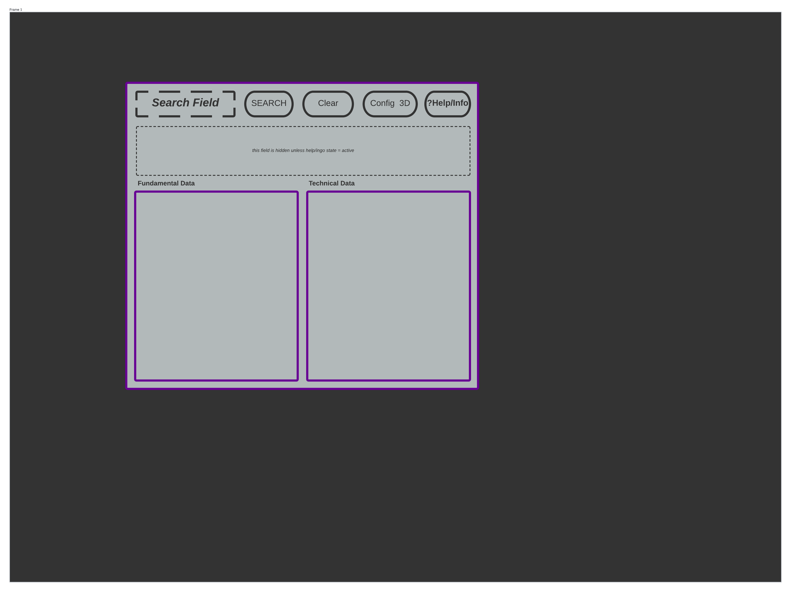

# Main Window, Application Interface

[Back to README](../../../README.md)

The Main Window will act as the primary user interface with the application. The relevant User Stories related to the design of main_window are linked below. Upon closing of main_win, the application state should exit.

**User Stories:**
[General Use and GUI](../../user_stories/general_use_ui.md)

## Required Packages and Resources

For more details on a given resource, see [Packages And Libraries](../../pkg_lib.md). The GUI interface will utilize the Tkinter Module of python and incorporate other GUI libraries and modules as necessary.

### Overview of Design Approach

The main interface should be clean and simple to navigate. Buttons and Searchbar should be easily identifiable and stand out from the background as well as be clearly separated from other information displayed on the main window. Output display areas should be clearly labeled.

Main interface should be sized in such a way that "full-screen" is optional and not the default. All relevant information and interactive elements should be clearly visible on the main window, without the need to scroll in either vertical or horizontal directions. Display sections of the main window may have scroll features.

### List of Required Elements

- Search field
- Search button
- Config/Start button for 3D modeling Feature
- Tab/Readout for list of Available Fundamental Data
- Tab/Readout for list of Available Technical Data
- Collapseable "general use information" section
- Help/Info button
- Clear Results button

### Description and Characteristics of Required Elements

*Search-Bar and Search Button:*
These two elements should be adjacent to each other on the interface window. The field should be clearly demarcated from the background of the window and centered. The field and the button should both be clearly and explicitly labeled, and the button should also make use of an explicit search Icon.

The functionality of the search button and what can be searched for should be outlined and addressed as it's own design/feature document. See `search_info/search.md` for list of what data should be retrieved and where it should be displayed upon activation of the search function. NOTE: onClick set "clear" button state to "active"

*Config/Start button for 3D model:*
This button should open a dialog window as a seperate entity from the main window, details on the design of this window and what elements are required for it should be addressed in a design document of its own. See `3d_model_config/3d_conf.md` for functionality and design parameters.

This button should have a state set to "inactive" if no stock has been searched for and/or no information is available in the readout

this button should have a clearly delineated section relative to it describing what its purpose is, ie: "click to open a configuration window for creating a 3D model of selected available data" Or " You must search for a company before creating a data model" dependent upon the button's state.

*Tab/Readout of Fundamental Data:*
This readout section should be demarcated by using "recess" attribute and a shadowed border. the size of this section should be equal to its counterpart and collectively account for the majority of the space available in the main_window. Information in this section should be formatted as a list and each list item should be interactive, and upon clicking should bring up an independent display window for veiwing its details.

*Tab/Readout of Technical Data:*
This readout section should be demarcated by using "recess" attribute and a shadowed border. the size of this section should be equal to its counterpart and collectively account for the majority of the space available in the main_window. Information in this section should be formatted as key:value pairs and each line item should be interactive, and upon clicking should bring up an independent display window for veiwing its value over time details as the appropriate chart-type.

*Help and Info button, General Use info:*
The Help/Info button should be clearly marked with an explicit help/information Icon. Button should have a state defualted to "active", in the active state, a section containing "how to use this application" information should be rendered in the main window across the "top" of the window. The button should be labeled with a "show/hide" caption. onClick the button state should change and in state: "inactive" the information section should then be hidden.

As the functionality of the Help/Info button will be expanded in the future as MVP is acheived and additional features are added to the application, design details regarding the funcitonality of this button should be outlined in `help_info_guide/help_info.md`.

*Clear Results Button:*
This button should be positioned relative to the Search Button. The sole purpose of this button is to clear all results from the Fundamental and Technical Readouts and change its own state to: "unavailable" becoming "available only when the search button is clicked. NOTE: Independent Design document for this feature is not required!!! onClick clear data set self.state "inactive".

