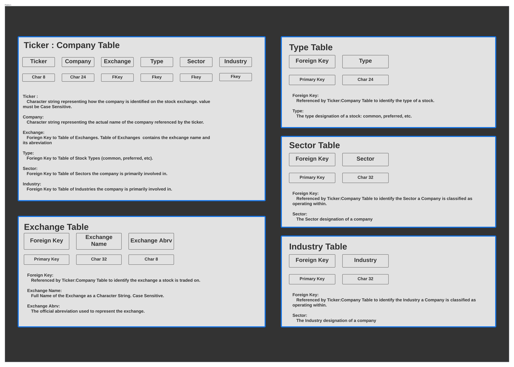

# Search Field and Button

[Back to README](../../../README.md)
[Back to Design.md](../../design.md)

The following is an outline of the search field, its design attributes and interaction with the related button. Specifications will be separated between the field itself and the callable button.

**User Stories**
[General Use and GUI](../../user_stories/general_use_ui.md)

## Required Packages and Resources

For more details on a given resource, see [Packages And Libraries](../../pkg_lib.md).

*AlphaVantage API* the search feild should query the API for both company and ticker matches, and return a context box with the top 10 results. See [AlphaVantage Ticker Query](https://polygon.io/docs/get_v3_reference_tickers_anchor)

*Python Module: Request* built-in module for web request:response protocols.

*httpie: package* package for making http requests via terminal, used for testing the WRRC of this Application.

### Overview of Design Approach

In the effort to minimize extaneous API Calls the application should have a DB table that stores all active tickers and corresponding company names which can then be querried in place of the api for search function auto-suggest/results display; and only further query the API when a specific selection has been made. The DB table should be updated on application start only.

Future versions of the application may utilize an auto-suggest feature for the search field but for MVP search should only execute onClick of the search button and the top 10 results of the search should be displayed in a separate windowed frame that allows the user to click the desired result and have its data displayed in the main window, automatically closing the results frame on selection.

### List of Required Elements

- DB table of currently active Ticker:Company pairs
- Start-up function to update DB table from the API
- callback for search-button querries DB for ticker OR Company Name up to 4 matching Chars and opens a new window with top ten results
- results should have a callback that querries the API for further data and displays that data in the corresponding data lists in the main window (fundamental data, technical data).

### Description and Characteristics of Required elements

*Database Table:*
MVP will require only name and ticker pairs but in the interest of future proofing with optional search filters it should also include:

- market
- primary exchange
- type (common, preferred, etc)

*Start-up Script DB Schema:*
This script should run on application start and query the API. For ease and speed the previous table should be dropped, a new table created based on a schema and populated as a result of the API query.

*Search-Button Callback:*
This callback should return all results that exactly match the search. If no matches are found it should return the results that match in descending order based on number of consecutive characters matching. In such a case results should be prioritized by length of the search term; if search term is less or equal to 4 chars, prioritize matching based on ticker, else based on company name.

*Result Callbacks:*
Each result displayed should have a callback that queries the api for the data categorically defined below.

#### Data Requests by Category

Each search item should be in terms of quarterly over time extending for the life of the company with the exception  of: Balance Sheet, Cash-Flow Statement, and Income statement which should be for the current year. Future additions to the search feature may include an option for viewing specific items from these financial statements over a given time period. 

The table below is for reference only, table items should appear in the application grouped and sorted acording to type, time (current first: descending).

| Fundamental Search Items | Technical Search Items | 
| ------------ | ---------- | 
| Balance Sheet | Day High (high) |
| Cash-Flow Statement | Day Low (low) |
| Income Statement | Day Open (open) |
| Price/Earnings (P/E) | Day Close (close) |
| Debt/Equity (D/E) | 20 Day High/Low (H/L20) |
| Return on Equity (ROI) | 50 Day High/Low (H/L50) |
| Price/Free Cash Flow (P/FCF)| 52 Week High/Low (H/Lyr) |
| Return on Investment (ROI) | 20 Day Simple Moving Average (SMA20) |
| Gross Margin | 50 Day Simple Moving Average (SMA50) |
| Price to Earnings Growth (PEG) | 200 Day Simple Moving Average (SMA200) |
| Operating Margin | Beta |
| Price/Sales (P/S) | Average Volume |
| Price to Book (P/B) | Day Volume |
| Return on Assets (ROA) | Shares Outstanding |
| Long Term Debt/Equity (LTD/E) |  |
| Payout Ratio (Div Yield) |  |
| Earnings Before Interest Taxes Depreciation Amortization (EBITDA) |  |

**DB Table Diagram:**

**Start-up Script Schema WRRC:**

**Search-Button Algo/Whiteboard:**

**Search Result Window Wireframe:**

