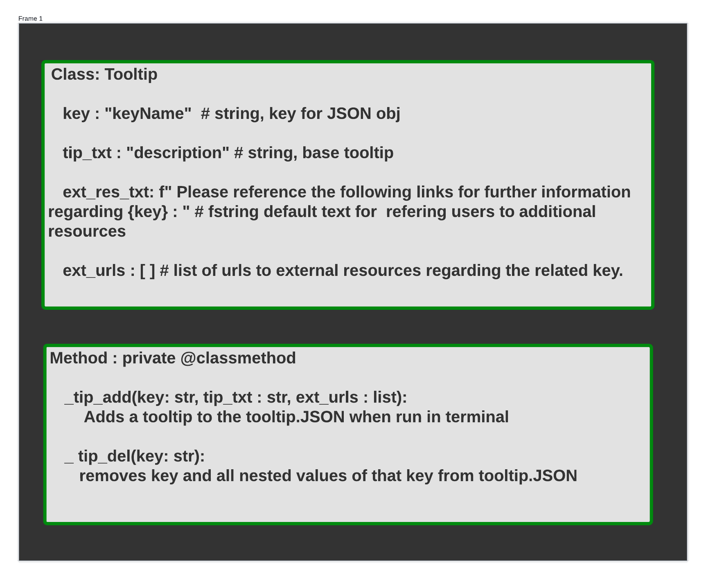
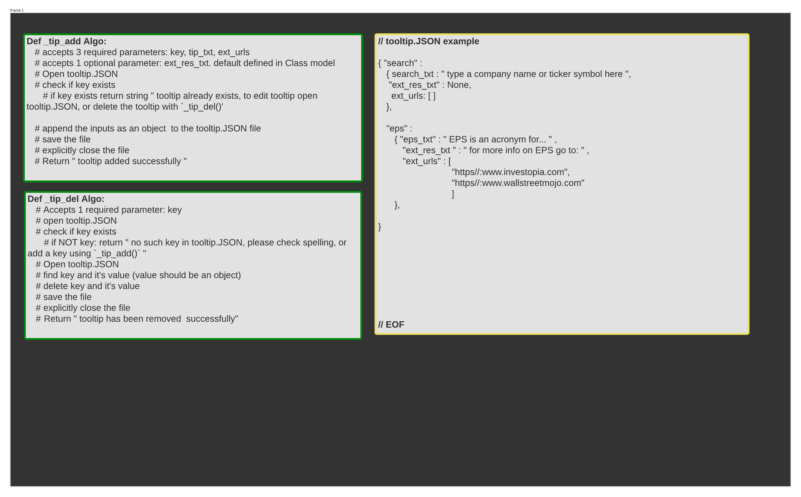

# Tooltip and Information, Display Frame

- [Back to README](../../../README.md)
- [Back to Design Docs](../../design.md)

Main window should have a section dedicated to displaying information about any element of the the application or the application readout the cursor is hovered over.

## User Stories

- [Tutorials and Education](../../user_stories/tutorials_education.md)
- [General Use and UI](../../user_stories/general_use_ui.md)

## Required Packages and Resources

For more details on a given resource, see [Packages And Libraries](../../pkg_lib.md). This feature should only require the python built-ins: JSON, and sys.

### Overview of Design Approach

This feature has two components, the first is developer utilities for ease of updating the collection of tooltips for the various application elements; the second is the actual implementation including display and the event binding.

#### Developer Tooltip Utility

All tooltip text and relevant external links should be contained in a local `tooltip.JSON` file in the root directory. A `tooltip_util.py` file should be added to the `_utilities/` directory and back-linked as an index item in the `_util.md` file.

The `tooltip_util.py` file should contain private methods of the `<class: Tooltip>` that can be run in the CLI to add/remove tooltip entries. More detailed editing of the tooltip text or external links should be done directly in the `tooltip.JSON` file

#### Tooltip Implementation

Tooltip Class should be defined in the `classes/` directory and should include methods for retrieving the correct entry from the tooltip.JSON file, and a method navigating to any external links provided.

Tooltips regarding complex features or elements, should contain external links (utilizing the system's default browser) to further resources and information.

There should be a default text welcoming the user and describing the general use and navigation of the application as well as where to find more detailed information as the application develops.

**Example:**

```Markdown

    // tooltip regarding label: "EPS"
    // when user hovers over above label tootip section should read:

    "EPS is an acronym for 'Earnings Per Share', this is used as a general measure of how much the company earned for a given period for every outstanding share of stock issued by the company. For more detailed information regarding EPS and its use in a company's valuation see: https//:www.investopia.com "

    // NOTE: link in example for demonstration purposes only, the actual link used in a tooltip with external resources should be chosen for it's clarity and free availability.

```

- The tooltip text and links should be displayed in a frame.
- Its contents should update onHover over any widget/element that has a tooltip entry.
- Frame should have no border or a very light border using relief to set it apart from other elements
- should display default text where no tooltip attribute is found on a widget/element.

---

**Class Models and Whiteboards:**




